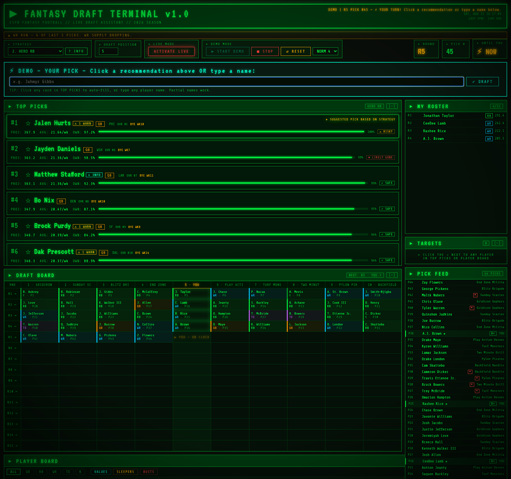

# FANTASY FOOTBALL TERMINAL

A CRT-styled live draft assistant for ESPN fantasy football leagues. Connects to
your league through the ESPN API, tracks picks as they happen, and recommends who
to take next based on the draft strategy you choose.



*Mid-draft in demo mode: strategy-driven recommendations with snipe-risk verdicts,
the live snake board, roster tracking, and the pick feed with grades and roasts.*

It boots like the machine it pretends to be:

```
> BIOS v2.6.1 - FANTASY FOOTBALL SYSTEMS INC.
> MEMORY TEST: 640K OK [OK]
> INITIALIZING ESPN API INTERFACE...
> CROSS-REFERENCING LEAGUE CHAMPIONSHIP DATA...
> HERO QB WIN COUNT: 0. STILL LOADING ANYWAY.
> ALL SYSTEMS NOMINAL. [OK]
> THIS TERMINAL ACCEPTS NO RESPONSIBILITY FOR YOUR PICKS
```

---

## Features

- **Live pick tracking** — polls your ESPN draft every 5 seconds; player
  projections and injury status re-pull every 10 minutes so a long session
  doesn't drift out of date
- **Snake draft board** — full teams × rounds grid, color-coded by position, with
  your column highlighted and the current pick flagged
- **Seven draft strategies** — League History, Hero RB, Balanced BPA, Late-Round QB,
  Robust RB, Zero-RB, and Hero QB, each with a round-by-round blueprint
- **Pick recommendations** — scored by projection, positional need, and your chosen
  strategy, with VALUE / BUST / SLEEPER tags
- **Snipe risk** — tells you whether a player is likely to survive until your next
  turn (SAFE / RISKY / LIKELY GONE), plus a "picks until you" countdown
- **Conflict engine** — flags bye-week stacks, same-position bye collisions, team
  stacks, tough playoff schedules, and roster-construction mistakes
- **Target list** — star players to watch; they get marked SNIPED when taken
- **Demo mode** — simulate a full draft against opponents that draft by value over
  replacement, to rehearse before the real thing

---

## Requirements

- Python 3.9 or newer
- An ESPN fantasy football league you're a member of

---

## Setup

### 1. Install

```bash
git clone <your-repo-url>
cd Fantasy-Football-Terminal
python3 -m venv env
env/bin/pip install -r requirements.txt
```

On Windows, `START_DRAFT.bat` does all of this for you — just double-click it.
Install Python from [python.org](https://www.python.org/downloads/) first, and
check **"Add Python to PATH"** during install.

### 2. League setup

Open `server.py` and fill in the Config block near the top:

```python
LEAGUE_ID    = 0      # the number in your ESPN league URL
YEAR         = 2026   # season year
ESPN_S2      = ''     # your espn_s2 cookie
SWID         = ''     # your SWID cookie (keep the braces)
MY_TEAM_ID   = 1      # your team's ID within the league
TOTAL_TEAMS  = 10
TOTAL_ROUNDS = 15
```

**Finding your cookies:** log into espn.com in Chrome, press `F12` →
**Application** → **Cookies** → `https://www.espn.com`, then copy the values of
`espn_s2` and `SWID`.

> ⚠️ **These cookies authenticate your ESPN account.** Never commit real values to
> a public repository, and rotate them (log out and back in) if they leak.

### 3. Roster settings

The default roster model is QB 1 / RB 2 / WR 2 / TE 1 / FLEX 2 / K 1. If your
league differs, edit `STARTER_NEEDS` in `server.py`.

### 4. League history (optional)

The **LEAGUE HISTORY** strategy is built from past champion drafts in the
`LEAGUE_HISTORY` block of `server.py`. It ships with example data — replace it
with your own league's results to make the strategy meaningful, or pick a
different strategy.

---

## Running

```bash
env/bin/python server.py
```

Then open <http://localhost:8888>. On Windows, double-click `START_DRAFT.bat`
(and `STOP_DRAFT.bat` to stop it).

---

## Draft day

1. Start the app and wait for the board to load
2. **Set your draft position** once it's announced — the countdown, board column,
   and snipe verdicts all depend on it
3. **Select a strategy** (click `? INFO` for its full blueprint)
4. Click **ACTIVATE LIVE** when the draft begins — it stays red until you do
5. Watch the pick feed; the screen flashes when you're on the clock

Picks refresh every 5 seconds. Projections and injury status refresh every 10
minutes (tune `BOARD_REFRESH_SECONDS` in `server.py`).

This tool is **read-only**. It never submits a pick. Whoever runs your draft still
enters every selection — call out your pick, then let the terminal catch up.

---

## Strategies

| # | Strategy | Best for |
|---|----------|----------|
| 1 | **League History** | Built from your own league's champion patterns |
| 2 | **Hero RB** | One elite RB, then stack WRs — the balanced default |
| 3 | **Balanced BPA** | Best player available, need as tiebreak |
| 4 | **Late-Round QB** | RB/WR for seven rounds, QB in R8–12 |
| 5 | **Robust RB** | Two or three RBs early; good from late snake slots |
| 6 | **Zero-RB** | WR/TE early, RB volume from R5 — high variance |
| 7 | **Hero QB** | Elite QB in R1 — contrarian, highest risk |

Sources: FantasyPros, The Ringer (Danny Heifetz), DraftSharks (Jared Smola, Shane
Hallam), Establish the Run, Shawn Siegele (RotoViz), JJ Zachariason.

---

## Player tags

| Tag | Meaning |
|-----|---------|
| 🟢 **VALUE** | Expert rank beats ADP — draft earlier than the crowd expects |
| 🔴 **BUST** | Publicly overvalued — let someone else overpay |
| 🟡 **SLEEPER** | Late-round upside dart — target rounds 11–14 |

---

## Troubleshooting

**Browser opens but shows an error** — wait ten seconds and refresh; the board
takes a moment to load on first run.

**Picks not updating** — make sure ACTIVATE LIVE is on. If it's still stuck, your
ESPN cookies have probably expired; refresh them per step 2 above.

**Port 8888 already in use** — stop the existing server first (`STOP_DRAFT.bat` on
Windows), then restart.

**Connection errors on startup** — check `LEAGUE_ID`, `ESPN_S2`, and `SWID` are
filled in and that you're a member of that league.

---

## Notes

Projections come from ESPN's own player data. Bye weeks and playoff strength-of-
schedule are hardcoded for the 2026 season in `server.py` and will need updating
for future seasons.

Built with FastAPI and [espn-api](https://github.com/cwendt94/espn-api).
